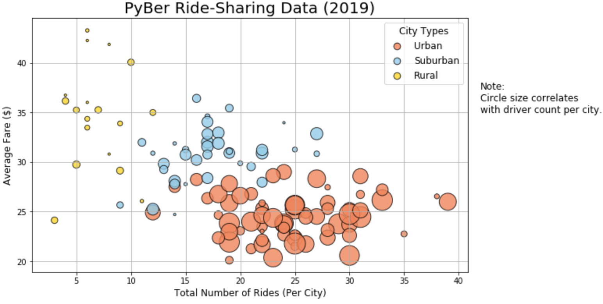
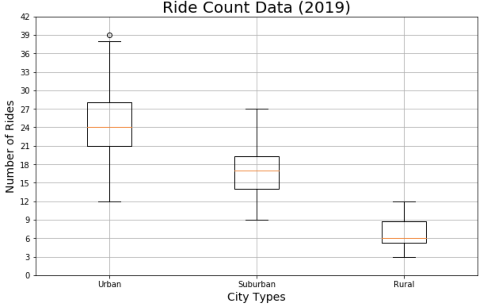
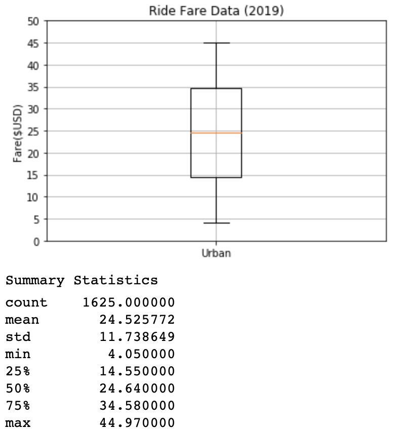
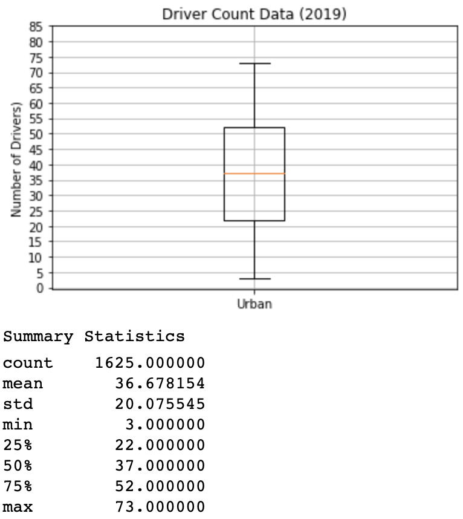
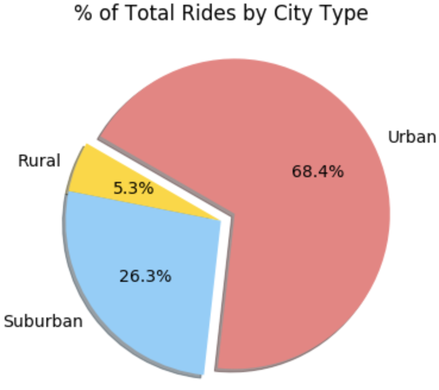

# Overview 
Analyzing ride sharing data based on city type (urban, suburban, rural). 

Goals:
* Clean and merge the DataFrames.
* Create a summary DataFrame.
* Create a pivot table DataFrame with the date as the index.
* Create a multiple-line plot for the sum of the fares for each city type.

## Tools/ Languages
* Python
* Pandas
* Numpy
* Scipy
* Matplotlib

# Visuals

This bubble chart shows the number of rides per city type with the average fare. It also shows the correlation of the number of drivers and the city type.

The box and whisker plot (above) shows the minimum, median, maximum, and the interquartile range (the 25th and 75th percentiles) of the number of rides in each city type.

This box and whisker plot (above) shows minimum, median, maximum, and the interquartile range of the ride fares in an urban city type. Along with the box and whisker plot there are summary statistics of the ride fares in an urban city. The urban city type was singled out because it has the most robust data out of the city types.

The box and whisker plot, above, shows minimum, median, maximum, and the interquartile range of the number of drivers in an urban city type. Along with the box and whisker plot there are summary statistics of the number of drivers in an urban city. The urban city type was singled out because it has the most robust data out of the city types.

The pie chart demonstrates the percentage of rides by city type. Validating the decision to single out the urban city for further analysis.
